# Technical Notes Deep Seed Pack — Fixed Markdown Preview

This preview removes literal HTML anchor tags from headings. Anchors are kept as API fields (`section.anchor`) instead of inline HTML.


# Amazon Route 53: DNS, Hosted Zones, Routing Policies, and Production Patterns

**Slug:** `aws-route53-deep-dive`  

**Sections:** 14


## What Route 53 Solves

**Definition:** Amazon Route 53 is AWS's DNS and domain-routing service. In practical terms, it answers the question: *when someone types `api.example.com`, which IP address, load balancer, CDN, or service endpoint should receive that traffic?*

Route 53 exists because production systems need more than a static DNS table. They need domain ownership, public/private DNS, routing decisions, failover, latency-based routing, health-aware records, and clean integration with AWS resources.

**Mental model:**

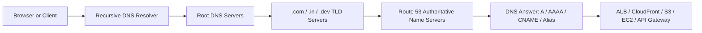

Route 53 is usually the **authoritativ


...


## Hosted Zones

A **hosted zone** is a container for DNS records for a domain. If your domain is `example.com`, the hosted zone contains records such as:

| Record | Meaning |
|---|---|
| `example.com` | apex/root domain |
| `www.example.com` | web frontend |
| `api.example.com` | API backend |
| `internal.example.com` | internal/private DNS name |

There are two main types:

| Type | Used for | Example |
|---|---|---|
| Public hosted zone | Internet-facing DNS | `www.shelendra.com -> CloudFront` |
| Private hosted zone | VPC-only DNS | `db.internal.local -> private RDS endpoint` |

**Important production idea:** public DNS and private DNS can share similar names, but they answer different audiences. A public hosted zone answers the internet. A private hosted zone answers resources inside associated VPCs.

## Records: A, AAAA, CNAME, MX, TXT, NS, SOA

A DNS record is a mapping between a name and an answer.

| Record type | Use |
|---|---|
| `A` | maps a name to IPv4 |
| `AAAA` | maps a name to IPv6 |
| `CNAME` | maps one hostname to another hostname |
| `MX` | mail routing |
| `TXT` | verification, SPF, DKIM, DMARC |
| `NS` | nameservers responsible for zone |
| `SOA` | administrative zone metadata |

**Interview explanation:**

> An A record resolves directly to an IPv4 address, while a CNAME points one hostname to another hostname. In Route 53, alias records are AWS-specific DNS shortcuts that can point to AWS resources like ALB or CloudFront and can work at the zone apex.

**Common mistake:** using CNAME at the root domain. Standard DNS does not allow a CNAME at the zone apex because the apex must also contain records such as NS and SOA. In Route 53, use an **alias** record for apex-to-AWS-resource routing.

## Alias Records vs CNAME

Route 53 alias records feel similar to CNAME records, but they behave differently.

| Feature | CNAME | Route 53 Alias |
|---|---|---|
| Points to another hostname | Yes | Yes, for supported AWS resources |
| Works at zone apex | No | Yes |
| Extra DNS query sometimes needed | Often | Usually no external extra lookup |
| AWS integration | Generic DNS | Native AWS targets |
| Typical target | `other.example.com` | ALB, CloudFront, S3 website endpoint, API Gateway |

**Use alias when:**

- pointing `example.com` to CloudFront
- pointing `api.example.com` to an ALB
- pointing apex/root to AWS-managed endpoints
- you want Route 53 to track AWS target changes

**Example use case:**

```txt
example.com      A/AAAA Alias -> CloudFront distribution
api.example.com  A Alias      -> Application Load Balancer
```

## DNS Resolution Flow and TTL

DNS uses caching heavily. The **TTL** tells resolvers how long they may cache an answer.

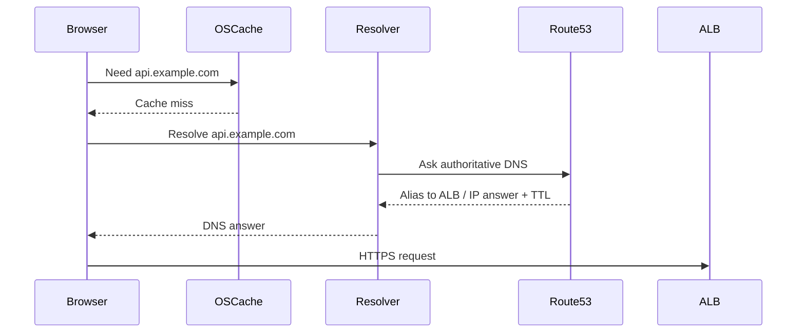

**Low TTL** helps faster DNS changes but increases DNS query volume.  
**High TTL** reduces DNS queries but makes failover/changes slower.

For migration windows, teams often reduce TTL before the change, wait for old cache to drain, perform the cutover, then increase TTL again.

## Routing Policies

Route 53 routing policies decide **which record answer** to return when multiple valid answers exist.

| Policy | Best when |
|---|---|
| Simple | one answer, no advanced logic |
| Weighted | split traffic by percentage |
| Latency | route to region with lowest latency |
| Failover | active-passive disaster recovery |
| Geolocation | route by user location |
| Geoproximity | route by resource/user location plus bias |
| Multivalue answer | return multiple healthy answers |
| IP-based | route based on source IP ranges |

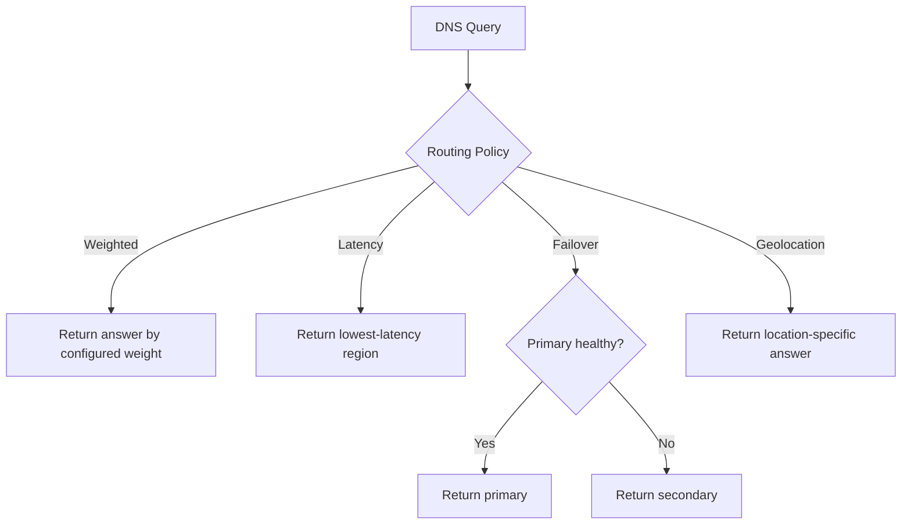

## Weighted Routing for Safe Releases

Weighted routing lets you move traffic gradually.

Example:

| Record | Weight |
|---|---:|
| old ALB | 90 |
| new ALB | 10 |

This gives roughly 10% of DNS responses to the new stack. It is useful for blue-green or canary releases.

**Caution:** DNS caching means traffic distribution is approximate, not exact per request. A resolver may cache the 10% answer and send many clients there until TTL expiry.

## Latency Routing for Multi-Region Apps

Latency routing is useful when the same application is deployed in multiple AWS Regions.

Example:

```txt
api.example.com -> us-east-1 ALB
api.example.com -> ap-south-1 ALB
api.example.com -> eu-west-1 ALB
```

Route 53 chooses the region expected to give the user lower latency. This is not necessarily geographically closest; it is based on AWS latency measurements.

**Good for:** global APIs, SaaS dashboards, read-heavy services.  
**Not enough for:** strong consistency writes unless the application/database layer is designed for multi-region consistency.

## Failover Routing and Health Checks

Failover routing creates active-passive DNS behavior.

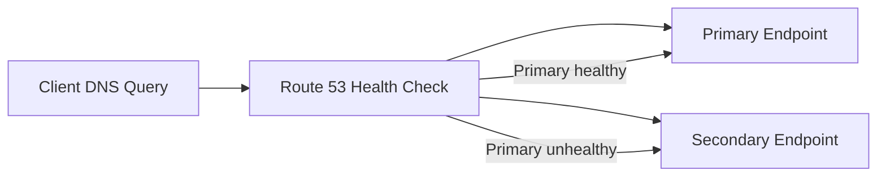

Important points:

- DNS failover depends on health check status and TTL.
- Existing clients may continue using cached records.
- Health checks should test a meaningful endpoint like `/health/ready`, not just whether the server accepts TCP.
- Health checks must match real user dependency readiness if possible.

## Private Hosted Zones and Resolver

Private hosted zones are used for DNS inside VPCs.

Example:

```txt
service.local
db.service.local
redis.service.local
```

These names should not resolve publicly. They are visible only inside associated VPCs.

Route 53 Resolver can bridge DNS between:

- VPCs
- on-premises networks
- private hosted zones
- corporate DNS servers

**Production pattern:**

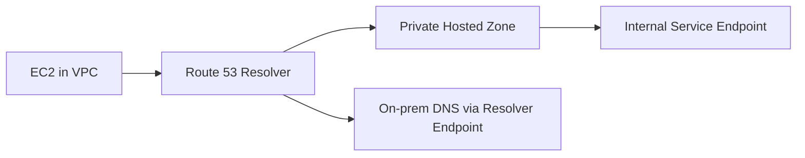

## Route 53 with CloudFront, ALB, S3, API Gateway

Common DNS mappings:

| Use case | Record |
|---|---|
| static website with CDN | `www.example.com -> CloudFront alias` |
| API backend | `api.example.com -> ALB alias` |
| root static site | `example.com -> CloudFront alias` |
| REST API | `api.example.com -> API Gateway custom domain` |
| S3 website | alias to S3 website endpoint, usually behind CloudFront |

**Rule of thumb:** expose CloudFront for global edge caching and TLS, ALB for application routing, and API Gateway for managed API front doors.

## Route 53 Terraform Example

```hcl
resource "aws_route53_zone" "main" {
  name = "example.com"
}

resource "aws_route53_record" "api" {
  zone_id = aws_route53_zone.main.zone_id
  name    = "api.example.com"
  type    = "A"

  alias {
    name                   = aws_lb.app.dns_name
    zone_id                = aws_lb.app.zone_id
    evaluate_target_health = true
  }
}
```

**Important:** for alias records, the target's hosted zone ID is not your domain zone ID. It is the canonical hosted zone ID of the AWS resource such as the ALB.

## Troubleshooting DNS

Useful commands:

```bash
dig api.example.com
dig +trace api.example.com
nslookup api.example.com
dig NS example.com
dig TXT example.com
```

Checklist:

1. Is the domain delegated to Route 53 nameservers?
2. Is the record in the correct hosted zone?
3. Are you querying public DNS or private VPC DNS?
4. Is TTL causing old answers?
5. Is the alias target healthy?
6. Is CloudFront/ALB/API Gateway configured with the same hostname?
7. Does the TLS certificate include the exact domain?

## Interview Questions and Answers

**Q: What is Route 53?**  
A: Route 53 is AWS's DNS and traffic-routing service. It hosts DNS zones, answers DNS queries, supports routing policies, integrates with AWS resources through alias records, and can perform health-check based failover.

**Q: Difference between CNAME and alias?**  
A: CNAME points a hostname to another hostname and cannot be used at the zone apex. Route 53 alias records are AWS-specific and can point to supported AWS resources, including at the apex.

**Q: Does Route 53 load balance HTTP requests?**  
A: Not directly. It returns DNS answers. Load balancing at request level is done by ALB/NLB/CloudFront/API Gateway. Route 53 can influence where clients connect.

**Q: Why DNS failover is not instant?**  
A: Because DNS answers are cached by resolvers according to TTL, and clients may keep using cached results until they expire.

# Docker: Images, Containers, Dockerfiles, Compose, Volumes, Networks, and Production Patterns

**Slug:** `docker-deep-dive`  

**Sections:** 13


## What Docker Solves

Docker packages an application with its runtime dependencies into an image, then runs that image as a container. This solves the classic problem: *it works on my machine but not on the server.*

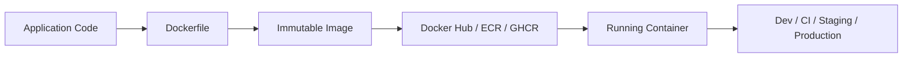

**Mental model:**

- **Image** = blueprint / artifact
- **Container** = running instance of an image
- **Dockerfile** = recipe for building image
- **Registry** = storage/distribution for images
- **Volume** = persistent data outside container lifecycle
- **Network** = communication boundary between containers

## Images, Layers, and Caching

Docker images are built in layers. Each Dockerfile instruction generally creates a layer.

```dockerfile
FROM python:3.12-slim
WORKDIR /app
COPY requirements.txt .
RUN pip install --no-cache-dir -r requirements.txt
COPY . .
CMD ["python", "main.py"]
```

Why copy `requirements.txt` before the rest of the source?

Because dependency installation changes less frequently than application code. This lets Docker reuse the expensive dependency layer when only code changes.

**Bad Dockerfile pattern:**

```dockerfile
COPY . .
RUN pip install -r requirements.txt
```

This invalidates dependency cache whenever any file changes.

## Containers and Isolation

A container is not a full virtual machine. It is a process isolated using OS features such as namespaces, cgroups, filesystem layers, and network isolation.

| VM | Container |
|---|---|
| has full guest OS | shares host kernel |
| heavier startup | faster startup |
| strong isolation boundary | process-level isolation |
| larger images | smaller images |

**Production point:** containers are isolated, but not magically secure. You still need least privilege, non-root users, patched base images, secrets management, and network controls.

## Dockerfile Best Practices

Good Dockerfile practices:

1. Use small base images when possible.
2. Pin meaningful versions.
3. Keep dependency layers before source-code layers.
4. Use `.dockerignore`.
5. Run as non-root.
6. Prefer exec-form `CMD`.
7. Avoid baking secrets into images.
8. Use multi-stage builds.

Example Node/React build:

```dockerfile
FROM node:22-alpine AS build
WORKDIR /app
COPY package*.json ./
RUN npm ci
COPY . .
RUN npm run build

FROM nginx:1.27-alpine
COPY --from=build /app/dist /usr/share/nginx/html
EXPOSE 80
CMD ["nginx", "-g", "daemon off;"]
```

## Multi-Stage Builds

Multi-stage builds let you use heavy build tools during compilation but ship only the final runtime artifact.

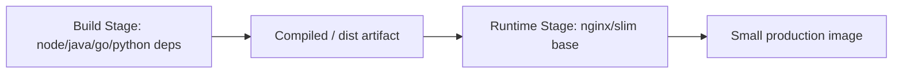

Benefits:

- smaller final image
- fewer vulnerabilities
- cleaner runtime
- faster deployment pulls

## Volumes and Bind Mounts

Containers are disposable. If a container is removed, its writable layer is removed too. Use storage mounts when data must survive.

| Type | Use |
|---|---|
| Named volume | database data, persistent app storage |
| Bind mount | local development source code |
| tmpfs | temporary sensitive/runtime-only data |

Example:

```bash
docker volume create postgres-data

docker run -d \
  --name notes-db \
  -e POSTGRES_PASSWORD=secret \
  -v postgres-data:/var/lib/postgresql/data \
  postgres:16
```

**Common mistake:** running Postgres without a volume and then losing data when the container is recreated.

## Docker Networks

Docker containers can communicate through networks.

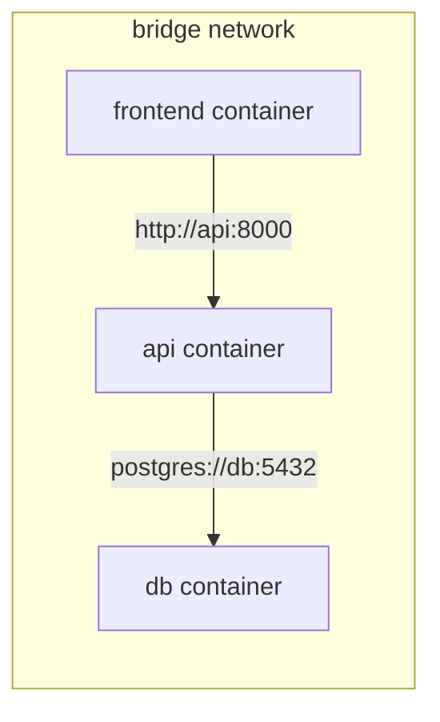

Inside a Docker Compose network, service names become DNS names. If your service is named `api`, another container can call `http://api:8000`.

**Important:** `localhost` inside a container means the container itself, not your host machine and not another container.

## Docker Compose for Multi-Service Apps

Compose defines multiple containers, their networks, volumes, ports, and environment.

```yaml
services:
  api:
    build: .
    ports:
      - "8000:8000"
    environment:
      DATABASE_URL: postgresql://notes:notes@db:5432/notes
    depends_on:
      - db

  db:
    image: postgres:16
    environment:
      POSTGRES_USER: notes
      POSTGRES_PASSWORD: notes
      POSTGRES_DB: notes
    volumes:
      - pgdata:/var/lib/postgresql/data

volumes:
  pgdata:
```

`depends_on` controls startup ordering, not true readiness. Your app should retry DB connections or use health checks.

## Dockerizing a FastAPI App

```dockerfile
FROM python:3.12-slim

ENV PYTHONDONTWRITEBYTECODE=1
ENV PYTHONUNBUFFERED=1

WORKDIR /app

COPY pyproject.toml uv.lock ./
RUN pip install --no-cache-dir uv \
 && uv sync --frozen --no-dev

COPY . .

EXPOSE 8000

CMD ["uv", "run", "uvicorn", "app.main:app", "--host", "0.0.0.0", "--port", "8000"]
```

For production, consider:

- running behind a reverse proxy/load balancer
- setting worker count intentionally
- using health checks
- ensuring logs go to stdout/stderr
- using secrets through runtime environment, not image layers

## Container Health Checks

Health checks tell orchestration systems whether a container should receive traffic or be restarted.

```dockerfile
HEALTHCHECK --interval=30s --timeout=5s --retries=3 \
  CMD python -c "import urllib.request; urllib.request.urlopen('http://localhost:8000/api/v1/health/live')"
```

Types of health:

| Type | Meaning |
|---|---|
| live | process is alive |
| ready | app is ready for traffic |
| startup | app finished slow initialization |

Do not make liveness depend on external systems unless you want external outage to restart every app container.

## Security and Production Hygiene

Checklist:

- use non-root user
- do not store `.env` or secrets in images
- scan images
- pin base images
- remove build tools from runtime images
- use read-only filesystem where possible
- limit CPU/memory in production
- log to stdout/stderr
- use trusted registries
- avoid `latest` in production

Example non-root setup:

```dockerfile
RUN addgroup --system app && adduser --system --ingroup app app
USER app
```

## Docker Troubleshooting

Useful commands:

```bash
docker ps
docker ps -a
docker logs -f container_name
docker exec -it container_name sh
docker inspect container_name
docker network ls
docker volume ls
docker compose logs -f api
docker compose down -v
```

Common issues:

| Symptom | Likely cause |
|---|---|
| app cannot reach DB | wrong hostname; use Compose service name |
| port already in use | host port conflict |
| changes not reflected | image cache or no bind mount |
| container exits instantly | bad CMD or missing env |
| permission denied | non-root user cannot write mounted path |

## Interview Questions and Answers

**Q: Image vs container?**  
A: Image is an immutable packaged artifact. Container is a running isolated process created from that image.

**Q: Dockerfile vs Compose?**  
A: Dockerfile builds an image. Compose defines how one or more containers run together.

**Q: Why multi-stage builds?**  
A: To keep build dependencies out of the final runtime image, reducing size and attack surface.

**Q: Why is localhost confusing in Docker?**  
A: Inside a container, localhost refers to that container. Other services must be reached by container/service name or network address.

# Kubernetes: Pods, Deployments, Services, Ingress, Config, Scaling, and Debugging

**Slug:** `kubernetes-deep-dive`  

**Sections:** 14


## What Kubernetes Solves

Kubernetes is a platform for running containerized workloads declaratively. Instead of manually starting containers on servers, you describe the desired state: replicas, image version, ports, config, resources, rollout strategy, and exposure.

Kubernetes continuously tries to make actual state match desired state.

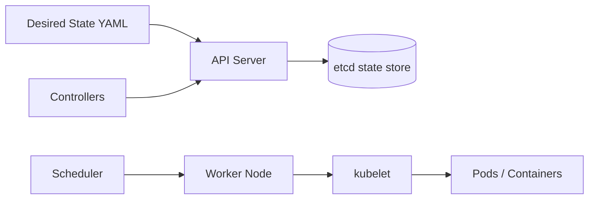

**Mental model:** Kubernetes is not just a container runner. It is a control-loop system.

## Cluster Architecture

A Kubernetes cluster has a **control plane** and **worker nodes**.

| Component | Role |
|---|---|
| API Server | front door for all cluster operations |
| etcd | persistent cluster state |
| Scheduler | chooses nodes for Pods |
| Controller Manager | reconciles desired vs actual state |
| kubelet | node agent that runs Pods |
| kube-proxy / CNI | networking |
| container runtime | runs containers |

Every `kubectl apply` goes through the API server. Controllers then act to make the cluster match the submitted spec.

## Pods: Smallest Deployable Unit

A Pod is the smallest deployable compute unit in Kubernetes. It can contain one or more containers that share:

- network namespace
- IP address
- volumes
- lifecycle

Usually, one Pod contains one main application container. Multi-container Pods are used for sidecars, proxies, log shippers, or tightly coupled helpers.

```yaml
apiVersion: v1
kind: Pod
metadata:
  name: notes-api
spec:
  containers:
    - name: api
      image: ghcr.io/example/notes-api:1.0.0
      ports:
        - containerPort: 8000
```

**Important:** Pods are disposable. Do not depend on a Pod's identity unless using StatefulSets.

## Deployments and ReplicaSets

A Deployment manages stateless application Pods through ReplicaSets.

```yaml
apiVersion: apps/v1
kind: Deployment
metadata:
  name: notes-api
spec:
  replicas: 3
  selector:
    matchLabels:
      app: notes-api
  template:
    metadata:
      labels:
        app: notes-api
    spec:
      containers:
        - name: api
          image: ghcr.io/example/notes-api:1.0.0
          ports:
            - containerPort: 8000
```

When you update the image, Deployment creates a new ReplicaSet and gradually replaces old Pods.

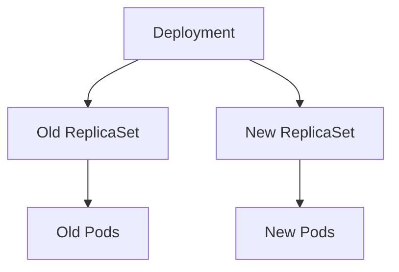

## Services

A Service gives stable networking to a changing set of Pods.

Pods come and go; their IPs change. A Service selects Pods by labels and gives them a stable virtual endpoint.

```yaml
apiVersion: v1
kind: Service
metadata:
  name: notes-api
spec:
  selector:
    app: notes-api
  ports:
    - port: 80
      targetPort: 8000
  type: ClusterIP
```

Service types:

| Type | Meaning |
|---|---|
| ClusterIP | internal-only stable IP |
| NodePort | exposes port on every node |
| LoadBalancer | asks cloud provider for external LB |
| ExternalName | DNS alias to external name |

## Ingress

Ingress manages HTTP/HTTPS entry into the cluster. It maps host/path rules to Services.

```yaml
apiVersion: networking.k8s.io/v1
kind: Ingress
metadata:
  name: notes-ingress
spec:
  rules:
    - host: notes.example.com
      http:
        paths:
          - path: /api
            pathType: Prefix
            backend:
              service:
                name: notes-api
                port:
                  number: 80
```

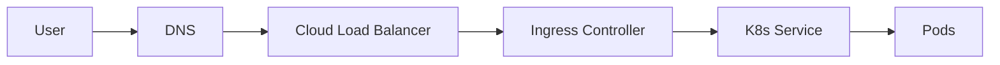

Ingress requires an ingress controller such as NGINX Ingress, AWS Load Balancer Controller, Traefik, or another controller.

## ConfigMaps and Secrets

ConfigMaps store non-sensitive configuration. Secrets store sensitive values such as passwords and tokens.

```yaml
apiVersion: v1
kind: ConfigMap
metadata:
  name: notes-config
data:
  LOG_LEVEL: "info"
---
apiVersion: v1
kind: Secret
metadata:
  name: notes-secret
type: Opaque
stringData:
  DATABASE_PASSWORD: "change-me"
```

Use them as environment variables:

```yaml
env:
  - name: LOG_LEVEL
    valueFrom:
      configMapKeyRef:
        name: notes-config
        key: LOG_LEVEL
  - name: DATABASE_PASSWORD
    valueFrom:
      secretKeyRef:
        name: notes-secret
        key: DATABASE_PASSWORD
```

**Production note:** Kubernetes Secrets are base64-encoded by default, not automatically encrypted from everyone. Configure encryption at rest and RBAC carefully.

## Readiness, Liveness, and Startup Probes

Probes help Kubernetes decide whether to route traffic or restart containers.

```yaml
livenessProbe:
  httpGet:
    path: /api/v1/health/live
    port: 8000
  initialDelaySeconds: 20
  periodSeconds: 10

readinessProbe:
  httpGet:
    path: /api/v1/health/ready
    port: 8000
  periodSeconds: 5
```

| Probe | Purpose |
|---|---|
| readiness | should this Pod receive traffic? |
| liveness | should this Pod be restarted? |
| startup | has slow boot completed? |

Common mistake: using the same endpoint for liveness and readiness. Readiness can depend on DB. Liveness should usually prove the process is not deadlocked.

## Requests, Limits, and Scheduling

Resource requests and limits guide scheduling and runtime control.

```yaml
resources:
  requests:
    cpu: "250m"
    memory: "256Mi"
  limits:
    cpu: "1"
    memory: "512Mi"
```

| Field | Meaning |
|---|---|
| requests | what scheduler reserves |
| limits | maximum allowed usage |

If memory exceeds the limit, the container may be OOMKilled. CPU limit throttles; memory limit kills.

**Interview tip:** requests influence placement; limits influence enforcement.

## Horizontal Pod Autoscaler

HPA scales replicas based on metrics such as CPU, memory, or custom metrics.

```yaml
apiVersion: autoscaling/v2
kind: HorizontalPodAutoscaler
metadata:
  name: notes-api
spec:
  scaleTargetRef:
    apiVersion: apps/v1
    kind: Deployment
    name: notes-api
  minReplicas: 2
  maxReplicas: 10
  metrics:
    - type: Resource
      resource:
        name: cpu
        target:
          type: Utilization
          averageUtilization: 70
```

HPA does not make slow code fast. It adds replicas when load patterns and metrics indicate that scaling out helps.

## Rollouts and Rollbacks

Useful commands:

```bash
kubectl apply -f deployment.yaml
kubectl rollout status deployment/notes-api
kubectl rollout history deployment/notes-api
kubectl rollout undo deployment/notes-api
kubectl set image deployment/notes-api api=ghcr.io/example/notes-api:1.0.1
```

Rolling updates work by gradually replacing old Pods with new Pods. Readiness probes control whether new Pods are considered available.

## Debugging Kubernetes

```bash
kubectl get pods
kubectl describe pod notes-api-abc123
kubectl logs -f deployment/notes-api
kubectl exec -it notes-api-abc123 -- sh
kubectl get events --sort-by=.metadata.creationTimestamp
kubectl get svc,ingress,deploy
kubectl top pods
```

Debug patterns:

| Symptom | Check |
|---|---|
| CrashLoopBackOff | logs, command, env, missing config |
| ImagePullBackOff | image name, tag, registry auth |
| Pending Pod | resources, taints, node capacity |
| Service not routing | labels/selectors, targetPort |
| Ingress 404 | host/path rules, ingress class |

## Kubernetes Manifest for Notes API

```yaml
apiVersion: apps/v1
kind: Deployment
metadata:
  name: technical-notes-api
spec:
  replicas: 3
  selector:
    matchLabels:
      app: technical-notes-api
  template:
    metadata:
      labels:
        app: technical-notes-api
    spec:
      containers:
        - name: api
          image: ghcr.io/shelendra/technical-notes-api:1.0.0
          ports:
            - containerPort: 8000
          env:
            - name: DATABASE_URL
              valueFrom:
                secretKeyRef:
                  name: technical-notes-secrets
                  key: DATABASE_URL
          readinessProbe:
            httpGet:
              path: /api/v1/health/ready
              port: 8000
          livenessProbe:
            httpGet:
              path: /api/v1/health/live
              port: 8000
          resources:
            requests:
              cpu: "250m"
              memory: "2


...


## Interview Questions and Answers

**Q: Pod vs Deployment?**  
A: Pod is the runtime unit. Deployment is the controller that manages replicated stateless Pods, rollout, rollback, and desired state.

**Q: Service vs Ingress?**  
A: Service gives stable networking to Pods. Ingress gives HTTP/HTTPS routing from outside the cluster to Services.

**Q: Why do we need readiness probes?**  
A: To prevent traffic from reaching Pods that are running but not ready to handle requests.

**Q: What happens when a Pod dies?**  
A: If managed by a controller such as Deployment, Kubernetes creates a replacement Pod to restore desired replicas.

# PyTorch: Tensors, Autograd, nn.Module, DataLoaders, Training Loops, and Production ML Patterns

**Slug:** `pytorch-deep-dive`  

**Sections:** 14


## What PyTorch Solves

PyTorch is a deep learning framework built around tensors, automatic differentiation, neural network modules, optimizers, and GPU acceleration.

At a high level, PyTorch lets you write normal Python code while still building differentiable computation graphs for machine learning.

```mermaid
flowchart LR
    Data[Dataset] --> Loader[DataLoader]
    Loader --> Batch[Mini-batches]
    Batch --> Model[nn.Module]
    Model --> Pred[Predictions]
    Pred --> Loss[Loss Function]
    Loss --> Backward[loss.backward()]
    Backward --> Optim[optimizer.step()]
    Optim --> Model
```

**Mental model:** PyTorch training is repeated numeric transformation plus gradient-based parameter updates.

## Tensors

A tensor is a multi-dimensional array used to store inputs, outputs, labels, and model parameters.

```python
import torch

x = torch.tensor([[1.0, 2.0], [3.0, 4.0]])
w = torch.randn(2, 3)

print(x.shape)   # torch.Size([2, 2])
print(w.dtype)   # torch.float32 by default
print(w.device)  # cpu or cuda/mps/xpu
```

Common tensor dimensions:

| Shape | Meaning |
|---|---|
| `()` | scalar |
| `(features,)` | single vector |
| `(batch, features)` | tabular batch |
| `(batch, channels, height, width)` | image batch |
| `(batch, sequence, embedding)` | NLP sequence batch |

**Common mistake:** shape mismatch. Always print shapes at model boundaries.

## Devices: CPU, CUDA, MPS

Models and tensors must be on the same device.

```python
import torch

device = (
    "cuda" if torch.cuda.is_available()
    else "mps" if torch.backends.mps.is_available()
    else "cpu"
)

model = model.to(device)
x = x.to(device)
y = y.to(device)
```

If model is on GPU and tensors are on CPU, PyTorch raises a device mismatch error.

**Interview explanation:** GPUs accelerate tensor operations through massive parallelism, but data transfer between CPU and GPU has overhead. Move data deliberately.

## Autograd and Computation Graphs

Autograd tracks operations on tensors with `requires_grad=True` and computes gradients during backpropagation.

```python
import torch

x = torch.tensor([2.0], requires_grad=True)
y = x ** 2 + 3 * x + 1
y.backward()

print(x.grad)  # dy/dx = 2x + 3 = 7
```

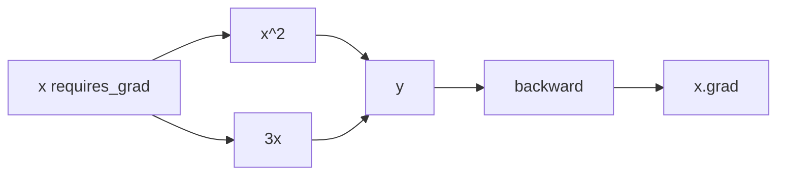

Autograd builds a dynamic graph at runtime. This makes debugging easier because the graph follows normal Python control flow.

## nn.Module

`nn.Module` is the base class for neural networks. A model usually defines layers in `__init__` and computation in `forward`.

```python
from torch import nn

class MLP(nn.Module):
    def __init__(self, in_features: int, num_classes: int):
        super().__init__()
        self.net = nn.Sequential(
            nn.Linear(in_features, 128),
            nn.ReLU(),
            nn.Dropout(0.2),
            nn.Linear(128, num_classes),
        )

    def forward(self, x):
        return self.net(x)
```

Why subclass `nn.Module`?

- parameters are registered automatically
- `.to(device)` moves all parameters
- `.train()` and `.eval()` switch behavior of dropout/batchnorm
- `state_dict()` enables saving/loading

## Datasets and DataLoaders

A `Dataset` knows how to access one sample. A `DataLoader` batches, shuffles, and parallelizes loading.

```python
from torch.utils.data import Dataset, DataLoader

class NotesDataset(Dataset):
    def __init__(self, rows, tokenizer):
        self.rows = rows
        self.tokenizer = tokenizer

    def __len__(self):
        return len(self.rows)

    def __getitem__(self, idx):
        text = self.rows[idx]["text"]
        label = self.rows[idx]["label"]
        encoded = self.tokenizer(text)
        return encoded, label

loader = DataLoader(
    NotesDataset(rows, tokenizer),
    batch_size=32,
    shuffle=True,
    num_workers=4,
)
```

**Good separation:** dataset handles sample access; model handles prediction; training loop handles optimization.

## Training Loop

A basic supervised training loop:

```python
import torch
from torch import nn

def train_one_epoch(model, loader, optimizer, loss_fn, device):
    model.train()
    total_loss = 0.0

    for x, y in loader:
        x = x.to(device)
        y = y.to(device)

        optimizer.zero_grad(set_to_none=True)
        logits = model(x)
        loss = loss_fn(logits, y)
        loss.backward()
        optimizer.step()

        total_loss += loss.item()

    return total_loss / len(loader)
```

Order matters:

```txt
zero gradients -> forward -> compute loss -> backward -> optimizer step
```

If you forget `optimizer.zero_grad()`, gradients accumulate across batches.

## Evaluation Loop

Evaluation should disable gradient tracking and switch the model to eval mode.

```python
def evaluate(model, loader, loss_fn, device):
    model.eval()
    correct = 0
    total = 0
    total_loss = 0.0

    with torch.no_grad():
        for x, y in loader:
            x, y = x.to(device), y.to(device)
            logits = model(x)
            loss = loss_fn(logits, y)
            total_loss += loss.item()

            preds = logits.argmax(dim=1)
            correct += (preds == y).sum().item()
            total += y.numel()

    return {
        "loss": total_loss / len(loader),
        "accuracy": correct / total,
    }
```

`torch.no_grad()` reduces memory use because PyTorch does not store intermediate tensors for gradients.

## Loss Functions and Optimizers

Common pairings:

| Task | Output | Loss |
|---|---|---|
| multi-class classification | raw logits `(N, C)` | `nn.CrossEntropyLoss()` |
| binary classification | logits `(N, 1)` | `nn.BCEWithLogitsLoss()` |
| regression | numeric value | `nn.MSELoss()` or `nn.L1Loss()` |

Optimizers:

```python
optimizer = torch.optim.AdamW(model.parameters(), lr=3e-4, weight_decay=1e-2)
loss_fn = nn.CrossEntropyLoss()
```

**Do not apply softmax before `CrossEntropyLoss`.** It expects raw logits and applies log-softmax internally.

## Saving and Loading Models

Recommended pattern:

```python
torch.save({
    "model_state": model.state_dict(),
    "optimizer_state": optimizer.state_dict(),
    "epoch": epoch,
    "config": config,
}, "checkpoint.pt")
```

Loading:

```python
checkpoint = torch.load("checkpoint.pt", map_location=device)
model.load_state_dict(checkpoint["model_state"])
optimizer.load_state_dict(checkpoint["optimizer_state"])
```

For inference-only:

```python
model.eval()
with torch.no_grad():
    output = model(x)
```

Save model architecture separately in code/config. `state_dict` stores weights, not the class definition.

## Mini CNN Example

```python
import torch
from torch import nn

class SmallCNN(nn.Module):
    def __init__(self, num_classes=10):
        super().__init__()
        self.features = nn.Sequential(
            nn.Conv2d(3, 32, kernel_size=3, padding=1),
            nn.ReLU(),
            nn.MaxPool2d(2),

            nn.Conv2d(32, 64, kernel_size=3, padding=1),
            nn.ReLU(),
            nn.MaxPool2d(2),
        )
        self.classifier = nn.Sequential(
            nn.Flatten(),
            nn.Linear(64 * 8 * 8, 128),
            nn.ReLU(),
            nn.Linear(128, num_classes),
        )

    def forward(self, x):
        x = self.features(x)
        return self.classifier(x)
```

For `32x32` input images, two `MaxPool2d(2)` operations reduce spatial size from `32 -> 16 -> 8`.

## Performance and Production Notes

Useful practices:

- use batches, not single samples
- use `pin_memory=True` for CUDA DataLoaders where helpful
- tune `num_workers`
- use mixed precision for GPU training when appropriate
- monitor GPU utilization
- avoid unnecessary CPU-GPU transfers
- profile before optimizing
- save checkpoints regularly
- seed randomness for reproducibility experiments

Example mixed precision sketch:

```python
scaler = torch.cuda.amp.GradScaler()

for x, y in loader:
    optimizer.zero_grad(set_to_none=True)
    with torch.cuda.amp.autocast():
        loss = loss_fn(model(x), y)
    scaler.scale(loss).backward()
    scaler.step(optimizer)
    scaler.update()
```

## Common Mistakes

| Mistake | Result |
|---|---|
| model on GPU, tensors on CPU | device mismatch error |
| forgetting `zero_grad()` | gradient accumulation |
| using softmax before CrossEntropyLoss | unstable/wrong training |
| not using `model.eval()` | dropout/batchnorm behave like training |
| not using `no_grad()` in validation | unnecessary memory usage |
| wrong tensor shape | linear/conv dimension errors |
| shuffling validation/test data unnecessarily | harder reproducibility/debugging |

## Interview Questions and Answers

**Q: What is autograd?**  
A: PyTorch's automatic differentiation engine. It records tensor operations dynamically and computes gradients during `backward()`.

**Q: What is `nn.Module`?**  
A: The base abstraction for trainable models/layers. It registers parameters, supports device movement, train/eval modes, and state dicts.

**Q: Why call `model.eval()`?**  
A: It changes behavior of layers like dropout and batch normalization for inference/evaluation.

**Q: What is a DataLoader?**  
A: It wraps a Dataset and provides batching, shuffling, multiprocessing, and iterable access to samples.

# Data Structures Interview Notes: Arrays, Strings, Linked Lists, Stacks, Queues, Hashing, Heaps, Trees, Graphs, Tries, and DSU

**Slug:** `data-structures-interview-deep-dive`  

**Sections:** 14


## How to Think About Data Structures

A data structure is a way to organize data so operations become efficient.

Every structure is a trade-off between:

- access
- search
- insertion
- deletion
- ordering
- memory
- implementation complexity

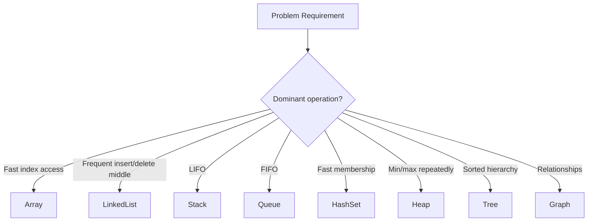

## Big-O and Complexity Q&A

**Q: What is Big-O?**  
A: Big-O describes how runtime or memory grows as input size grows. It ignores constants and lower-order terms.

| Complexity | Meaning |
|---|---|
| `O(1)` | constant |
| `O(log n)` | repeatedly halves search space |
| `O(n)` | scans input |
| `O(n log n)` | efficient comparison sorting/divide-conquer |
| `O(n^2)` | nested pair comparison |
| `O(2^n)` | subset/exponential recursion |

**Q: Why can O(n) beat O(log n)?**  
A: For small inputs or cache-friendly scans, constants matter. Big-O is asymptotic, not exact wall-clock time.

## Arrays and Dynamic Arrays

Arrays give fast index access.

| Operation | Complexity |
|---|---|
| access by index | `O(1)` |
| append dynamic array | amortized `O(1)` |
| insert/delete middle | `O(n)` |
| search unsorted | `O(n)` |
| search sorted | `O(log n)` |

Common patterns:

- two pointers
- sliding window
- prefix sums
- binary search
- in-place reversal
- partitioning

Example: prefix sum range query.

```python
def build_prefix(nums):
    pref = [0]
    for x in nums:
        pref.append(pref[-1] + x)
    return pref

def range_sum(pref, left, right):
    # inclusive left, exclusive right
    return pref[right] - pref[left]
```

## Strings

Strings are arrays of characters, but often immutable.

Common problems:

- palindrome
- anagram
- substring search
- frequency counting
- window with constraints
- parsing
- tries for prefix search

Example: valid anagram.

```python
from collections import Counter

def is_anagram(a: str, b: str) -> bool:
    return Counter(a) == Counter(b)
```

For lowercase letters only, use fixed array:

```python
def is_anagram_lower(a, b):
    if len(a) != len(b):
        return False
    freq = [0] * 26
    for x, y in zip(a, b):
        freq[ord(x) - 97] += 1
        freq[ord(y) - 97] -= 1
    return all(v == 0 for v in freq)
```

## Linked Lists

A linked list stores nodes connected by pointers.

```python
class Node:
    def __init__(self, val=0, next=None):
        self.val = val
        self.next = next
```

| Operation | Complexity |
|---|---|
| insert after known node | `O(1)` |
| delete after known node | `O(1)` |
| search | `O(n)` |
| index access | `O(n)` |

Classic interview tricks:

- dummy node
- slow/fast pointers
- reverse list
- detect cycle
- merge two sorted lists

Reverse linked list:

```python
def reverse(head):
    prev = None
    cur = head

    while cur:
        nxt = cur.next
        cur.next = prev
        prev = cur
        cur = nxt

    return prev
```

## Stacks

Stack = Last In, First Out.

Use when the most recent item must be processed first.

Problems:

- valid parentheses
- monotonic stack
- undo/redo
- expression evaluation
- DFS iterative

Valid parentheses:

```python
def is_valid(s):
    stack = []
    close_to_open = {")": "(", "]": "[", "}": "{"}

    for ch in s:
        if ch in close_to_open:
            if not stack or stack.pop() != close_to_open[ch]:
                return False
        else:
            stack.append(ch)

    return not stack
```

## Queues and Deques

Queue = First In, First Out.

Use for:

- BFS
- producer/consumer
- level-order traversal
- sliding window maximum with deque

```python
from collections import deque

def bfs(start, graph):
    seen = {start}
    q = deque([start])

    while q:
        node = q.popleft()
        for nei in graph[node]:
            if nei not in seen:
                seen.add(nei)
                q.append(nei)
```

Deque supports efficient operations on both ends.

## Hash Maps and Sets

Hash maps give average `O(1)` insert/search/delete.

Use for:

- frequency counting
- two-sum
- deduplication
- grouping
- memoization
- prefix sum lookup

Two sum:

```python
def two_sum(nums, target):
    seen = {}

    for i, x in enumerate(nums):
        need = target - x
        if need in seen:
            return [seen[need], i]
        seen[x] = i

    return []
```

**Caution:** worst-case hash performance can degrade with collisions, but average-case is excellent.

## Heaps / Priority Queues

A heap efficiently tracks min or max.

Python has min-heap:

```python
import heapq

heap = []
heapq.heappush(heap, 5)
heapq.heappush(heap, 2)
heapq.heappush(heap, 9)
print(heapq.heappop(heap))  # 2
```

| Operation | Complexity |
|---|---|
| push | `O(log n)` |
| pop min | `O(log n)` |
| peek min | `O(1)` |

Use cases:

- top K elements
- merge K sorted lists
- Dijkstra
- scheduling
- streaming median with two heaps

## Trees and Binary Search Trees

Trees model hierarchy.

Binary tree traversal:

```python
def inorder(root):
    if not root:
        return []
    return inorder(root.left) + [root.val] + inorder(root.right)
```

BST property:

```txt
left subtree < node < right subtree
```

BST search:

```python
def search_bst(root, target):
    cur = root
    while cur:
        if cur.val == target:
            return cur
        cur = cur.left if target < cur.val else cur.right
    return None
```

Balanced BST gives `O(log n)` search/insert/delete. Unbalanced BST can become `O(n)`.

## Graphs

A graph has nodes and edges.

Representations:

```python
graph = {
    "A": ["B", "C"],
    "B": ["D"],
    "C": [],
    "D": [],
}
```

| Representation | Good for |
|---|---|
| adjacency list | sparse graphs |
| adjacency matrix | dense graphs / `O(1)` edge check |
| edge list | algorithms like Kruskal |

Graph questions usually require deciding:

- directed or undirected?
- weighted or unweighted?
- cyclic or acyclic?
- connected or disconnected?
- shortest path or traversal?

## Tries

A Trie stores strings by prefix.

Use cases:

- autocomplete
- prefix search
- word dictionary
- routing tables
- spell-check style problems

```python
class TrieNode:
    def __init__(self):
        self.children = {}
        self.end = False

class Trie:
    def __init__(self):
        self.root = TrieNode()

    def insert(self, word):
        cur = self.root
        for ch in word:
            cur = cur.children.setdefault(ch, TrieNode())
        cur.end = True

    def starts_with(self, prefix):
        cur = self.root
        for ch in prefix:
            if ch not in cur.children:
                return False
            cur = cur.children[ch]
        return True
```

## Union-Find / Disjoint Set

Union-Find tracks connected components.

```python
class DSU:
    def __init__(self, n):
        self.parent = list(range(n))
        self.rank = [0] * n

    def find(self, x):
        if self.parent[x] != x:
            self.parent[x] = self.find(self.parent[x])
        return self.parent[x]

    def union(self, a, b):
        ra, rb = self.find(a), self.find(b)
        if ra == rb:
            return False

        if self.rank[ra] < self.rank[rb]:
            ra, rb = rb, ra

        self.parent[rb] = ra

        if self.rank[ra] == self.rank[rb]:
            self.rank[ra] += 1

        return True
```

Use cases:

- cycle detection in undirected graph
- connected components
- Kruskal MST
- dynamic connectivity

## Data Structure Selection Interview Answers

**Q: When use HashMap vs TreeMap?**  
A: HashMap gives average O(1) lookup without ordering. TreeMap gives ordered keys with O(log n) operations.

**Q: When use heap vs sorting?**  
A: If you need all sorted elements, sort. If you need top K or repeated min/max, heap is often better.

**Q: Why use trie instead of hash set for words?**  
A: Trie supports prefix queries naturally. Hash set supports exact lookup.

**Q: Why linked list if arrays exist?**  
A: Linked lists support O(1) insertion/deletion when node reference is known, but poor cache locality and O(n) access make arrays better in many real cases.

# Algorithms Interview Notes: Binary Search, Two Pointers, Sliding Window, Sorting, Backtracking, Graphs, DP, Greedy, and Bit Manipulation

**Slug:** `algorithms-interview-deep-dive`  

**Sections:** 15


## How to Approach Algorithm Problems

Algorithmic thinking starts with classifying the problem.

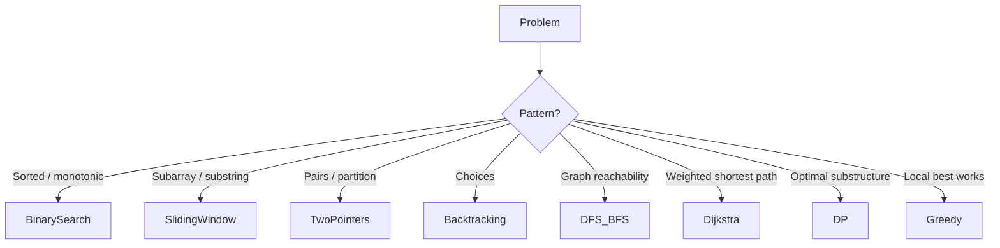

Interview process:

1. clarify input/output
2. ask constraints
3. identify brute force
4. find bottleneck
5. choose data structure/algorithm
6. prove correctness informally
7. analyze complexity
8. test edge cases

## Binary Search

Use binary search when the answer space is sorted or monotonic.

Classic template:

```python
def binary_search(nums, target):
    lo, hi = 0, len(nums) - 1

    while lo <= hi:
        mid = lo + (hi - lo) // 2

        if nums[mid] == target:
            return mid
        if nums[mid] < target:
            lo = mid + 1
        else:
            hi = mid - 1

    return -1
```

Lower bound:

```python
def lower_bound(nums, target):
    lo, hi = 0, len(nums)

    while lo < hi:
        mid = (lo + hi) // 2
        if nums[mid] < target:
            lo = mid + 1
        else:
            hi = mid

    return lo
```

**Key:** binary search is not only for arrays. It works on any monotonic predicate.

## Two Pointers

Two pointers are useful when movement of one or both ends reduces search space.

Example: pair sum in sorted array.

```python
def has_pair_sum(nums, target):
    left, right = 0, len(nums) - 1

    while left < right:
        s = nums[left] + nums[right]
        if s == target:
            return True
        if s < target:
            left += 1
        else:
            right -= 1

    return False
```

Common uses:

- sorted pair problems
- reversing
- partitioning
- removing duplicates
- palindrome checks

## Sliding Window

Sliding window is for contiguous subarray/substring problems.

Fixed window:

```python
def max_sum_k(nums, k):
    window = sum(nums[:k])
    best = window

    for right in range(k, len(nums)):
        window += nums[right] - nums[right - k]
        best = max(best, window)

    return best
```

Variable window:

```python
def longest_at_most_k_distinct(s, k):
    from collections import defaultdict

    freq = defaultdict(int)
    left = 0
    best = 0

    for right, ch in enumerate(s):
        freq[ch] += 1

        while len(freq) > k:
            old = s[left]
            freq[old] -= 1
            if freq[old] == 0:
                del freq[old]
            left += 1

        best = max(best, right - left + 1)

    return best
```

## Sorting Algorithms and When They Matter

Common sorting complexities:

| Algorithm | Average | Worst | Stable |
|---|---:|---:|---|
| Merge sort | O(n log n) | O(n log n) | yes |
| Quick sort | O(n log n) | O(n²) | usually no |
| Heap sort | O(n log n) | O(n log n) | no |
| Counting sort | O(n + k) | O(n + k) | yes possible |

Python's built-in sort is Timsort and is stable.

Use sorting when:

- order reveals structure
- intervals can be merged
- greedy choice depends on ordering
- duplicates grouping becomes easier

Merge intervals:

```python
def merge_intervals(intervals):
    intervals.sort()
    merged = []

    for start, end in intervals:
        if not merged or start > merged[-1][1]:
            merged.append([start, end])
        else:
            merged[-1][1] = max(merged[-1][1], end)

    return merged
```

## Recursion and Backtracking

Backtracking explores choices and undoes them.

```python
def subsets(nums):
    res = []
    path = []

    def dfs(i):
        if i == len(nums):
            res.append(path.copy())
            return

        path.append(nums[i])
        dfs(i + 1)

        path.pop()
        dfs(i + 1)

    dfs(0)
    return res
```

Backtracking framework:

```txt
choose -> explore -> unchoose
```

Use for:

- subsets
- permutations
- combinations
- N-Queens
- Sudoku
- word search

## BFS and DFS

DFS goes deep; BFS expands level by level.

DFS recursive:

```python
def dfs(node, graph, seen):
    if node in seen:
        return

    seen.add(node)

    for nei in graph[node]:
        dfs(nei, graph, seen)
```

BFS shortest path in unweighted graph:

```python
from collections import deque

def shortest_path_unweighted(graph, start, target):
    q = deque([(start, 0)])
    seen = {start}

    while q:
        node, dist = q.popleft()
        if node == target:
            return dist

        for nei in graph[node]:
            if nei not in seen:
                seen.add(nei)
                q.append((nei, dist + 1))

    return -1
```

Use BFS for minimum number of edges in unweighted graphs.

## Topological Sort

Topological sort orders nodes in a directed acyclic graph so dependencies come before dependents.

Kahn's algorithm:

```python
from collections import deque, defaultdict

def topo_sort(n, edges):
    graph = defaultdict(list)
    indeg = [0] * n

    for a, b in edges:
        graph[a].append(b)
        indeg[b] += 1

    q = deque([i for i in range(n) if indeg[i] == 0])
    order = []

    while q:
        node = q.popleft()
        order.append(node)

        for nei in graph[node]:
            indeg[nei] -= 1
            if indeg[nei] == 0:
                q.append(nei)

    return order if len(order) == n else []
```

If output length is less than `n`, the graph has a cycle.

## Dijkstra's Algorithm

Dijkstra finds shortest paths in graphs with non-negative edge weights.

```python
import heapq
from collections import defaultdict

def dijkstra(n, edges, src):
    graph = defaultdict(list)
    for u, v, w in edges:
        graph[u].append((v, w))

    dist = [float("inf")] * n
    dist[src] = 0

    heap = [(0, src)]

    while heap:
        d, node = heapq.heappop(heap)

        if d != dist[node]:
            continue

        for nei, w in graph[node]:
            nd = d + w
            if nd < dist[nei]:
                dist[nei] = nd
                heapq.heappush(heap, (nd, nei))

    return dist
```

Do not use Dijkstra with negative weights. Use Bellman-Ford or another suitable algorithm.

## Minimum Spanning Tree

MST connects all nodes with minimum total edge cost in an undirected weighted graph.

Kruskal uses sorting + DSU:

```python
def kruskal(n, edges):
    dsu = DSU(n)
    total = 0
    chosen = []

    for w, u, v in sorted(edges):
        if dsu.union(u, v):
            total += w
            chosen.append((u, v, w))

    return total, chosen
```

Use MST for:

- network cable planning
- clustering
- connecting components cheaply
- minimum-cost infrastructure

## Dynamic Programming

DP is used when problems have:

1. overlapping subproblems
2. optimal substructure

Example: climbing stairs.

```python
def climb_stairs(n):
    if n <= 2:
        return n

    prev2, prev1 = 1, 2

    for _ in range(3, n + 1):
        cur = prev1 + prev2
        prev2, prev1 = prev1, cur

    return prev1
```

DP thinking steps:

1. define state
2. define transition
3. define base cases
4. choose order
5. optimize memory if possible

## 0/1 Knapsack

```python
def knapsack(weights, values, capacity):
    dp = [0] * (capacity + 1)

    for w, v in zip(weights, values):
        for c in range(capacity, w - 1, -1):
            dp[c] = max(dp[c], dp[c - w] + v)

    return dp[capacity]
```

Why iterate capacity backward?

Because each item can be used at most once. Forward iteration would allow reusing the same item in the same round.

## Greedy Algorithms

Greedy chooses the locally best option. It works only when local optimal choices lead to global optimum.

Interval scheduling:

```python
def max_non_overlapping(intervals):
    intervals.sort(key=lambda x: x[1])

    count = 0
    last_end = float("-inf")

    for start, end in intervals:
        if start >= last_end:
            count += 1
            last_end = end

    return count
```

To justify greedy, explain why choosing earliest finishing interval leaves maximum room for future intervals.

## Bit Manipulation

Useful operations:

| Expression | Meaning |
|---|---|
| `x & 1` | odd/even |
| `x >> 1` | divide by 2 |
| `x << 1` | multiply by 2 |
| `x & (x - 1)` | remove lowest set bit |
| `x ^ x` | zero |
| `x ^ 0` | x |

Single number:

```python
def single_number(nums):
    ans = 0
    for x in nums:
        ans ^= x
    return ans
```

Works because duplicates cancel under XOR.

## Algorithm Interview Q&A

**Q: How do you identify DP?**  
A: If brute force repeatedly solves the same subproblems and the answer can be composed from smaller answers, try DP.

**Q: BFS vs DFS for shortest path?**  
A: BFS gives shortest path in unweighted graphs. DFS does not guarantee shortest path.

**Q: Dijkstra vs BFS?**  
A: BFS works for equal/unweighted edges. Dijkstra works for non-negative weighted edges.

**Q: When should binary search be considered?**  
A: When input is sorted or the answer predicate is monotonic: false false false true true.

**Q: Why sliding window?**  
A: For contiguous ranges where moving the left/right boundary can maintain a valid condition efficiently.